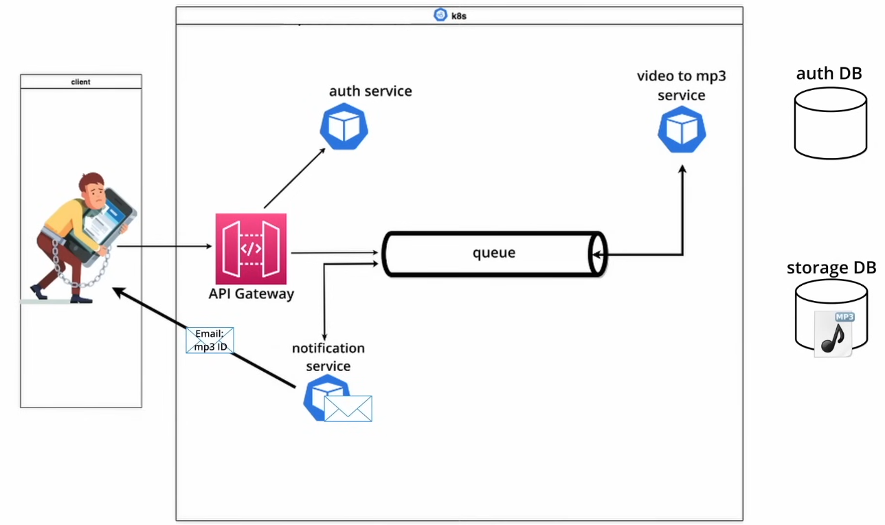

# MicroServe | Video to MP3 Converter | Microservices Architecture


This project is a **Video to MP3 Converter system** built using a **microservices architecture** and deployed on **Kubernetes (Minikube)**. Users authenticate, upload video files, have them asynchronously converted to MP3 using queues, receive email notifications upon completion, and finally download the converted audio file.

---

## High-Level Architecture



### Components

* **Client** – Uses `curl` or any HTTP client to interact with the system
* **API Gateway Service** – Entry point for all client requests
* **Auth Service** – Handles user authentication and JWT issuance (MySQL)
* **Video Queue** – Queue for uploaded video processing
* **MP3 Queue** – Queue for converted MP3 processing
* **Video-to-MP3 Converter Service** – Converts video files to MP3 using Python
* **Notification Service** – Sends email notifications after conversion
* **Auth Database (MySQL)** – Stores user credentials
* **Storage Database (MongoDB)** – Stores file metadata
* **Kubernetes (Minikube)** – Orchestrates all services and databases

---

## Tech Stack

* **Language**: Python
* **Containerization**: Docker
* **Orchestration**: Kubernetes (Minikube)
* **Databases**:

  * MySQL – Authentication data
  * MongoDB – File metadata & storage references
* **Messaging / Queues**: Two asynchronous queues (Video & MP3)
* **Authentication**: JWT (Bearer Token)
* **Email**: SMTP (Notification Service)

---

## Authentication Flow

1. User must **log in first**
2. Auth Service validates credentials from MySQL
3. JWT token is returned
4. Token is required for all protected endpoints

### Login (Get JWT Token)

```bash
curl -X POST http://mp3converter.com/login \
  -u <email>:<password>
```

**Response:**

```json
{
  "token": "<JWT_TOKEN>"
}
```

---

## Upload Video

After authentication, upload a video file for conversion.

```bash
curl -X POST \
  -F "file=@./<Video_name>" \
  -H "Authorization: Bearer <JWT_TOKEN>" \
  http://mp3converter.com/upload
```

### What happens internally?

1. API Gateway validates JWT
2. Video metadata is stored in MongoDB
3. Video is pushed to **Video Queue**
4. Converter service consumes from the queue

---

## Video to MP3 Conversion

* Converter Service (Python) consumes video messages
* Video is converted to MP3
* Result is pushed to **MP3 Queue**
* Converted file is stored

---

## Notification

Once conversion is complete:

* Notification Service consumes from MP3 Queue
* An **email is sent to the user** informing that the MP3 file is ready

Example email content:

```
Your MP3 file is ready!
File ID: <fid>
```

---

## Download MP3 File

After receiving the notification, the user can download the MP3 file using the file ID (`fid`).

```bash
curl -X GET \
  -H "Authorization: Bearer <JWT_TOKEN>" \
  --output mp3_download.mp3 \
  "http://mp3converter.com/download?fid=<mp3_file_id_in _the_email>"
```

---

## Databases

### MySQL (Auth DB)

* Stores user credentials
* Used by Auth Service

Example table:

```
user(email, password)
```

### MongoDB (Storage DB)

* Stores video & MP3 metadata
* File IDs, status, ownership

---

## Kubernetes Deployment (Minikube)

* Each service runs in its own **Pod**
* Databases deployed as Pods + Services
* Secrets used for credentials & tokens
* Internal service-to-service communication

Services deployed:

* auth-service
* api-gateway
* video-to-mp3-service
* notification-service
* mysql
* mongodb

---

## End-to-End Flow Summary

1. User logs in → gets JWT
2. User uploads video
3. Video added to Video Queue
4. Converter converts video → MP3
5. MP3 added to MP3 Queue
6. Notification email sent
7. User downloads MP3

---

✅ This project demonstrates **microservices, queues, authentication, Kubernetes, and asynchronous processing** in a real-world system.
